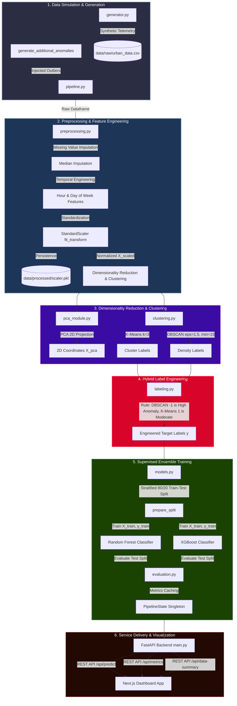
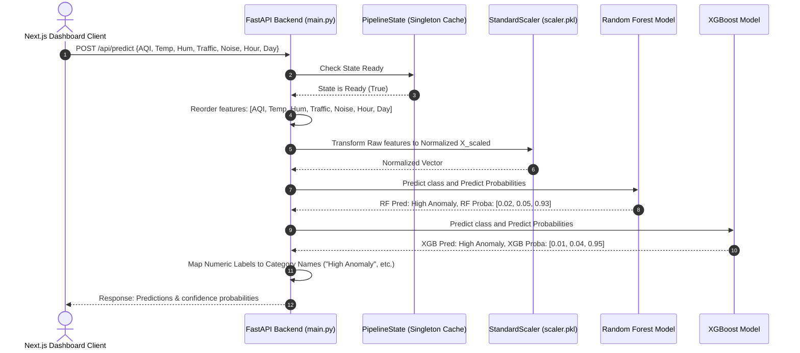

# Bangalore Smart City Intelligence Platform (BSCIP)
### AI-Powered Urban Command Center & Surveillance Console

---

## 1. Real-World Problem Statement (Bangalore Urban Context)

As the "Silicon Valley of India," the megacity of Bangalore has witnessed unprecedented demographic and physical expansion, scaling to a population exceeding 14 million. This exponential growth has outpaced municipal infrastructure development, creating severe, interconnected systemic crises across the urban landscape:

*   **Systemic Traffic Bottlenecks:** Major arterial nodes such as the Central Silk Board Junction, Outer Ring Road (ORR) corridor, Hebbal Flyover, and Tin Factory suffer from severe vehicular stagnation. Commuters regularly experience bumper-to-bumper delays of 2 to 3 hours daily. These prolonged traffic idling events create dense localized micro-climatic hot spots where vehicular exhaust accumulates heavily.
*   **Localized Air Quality Index (AQI) Spikes:** The combination of tailpipe emissions (nitrogen oxides, carbon monoxide, sulfur dioxide) and airborne particulate matter ($PM_{2.5}$ and $PM_{10}$) from continuous real estate construction causes severe localized spikes in the AQI, often breaching critical CPCB (Central Pollution Control Board) thresholds (>300) in high-density corridors like Whitefield and Marathahalli.
*   **Debilitating Noise Pollution:** Noise levels in transit zones frequently surge between 85 dB and 120 dB—well above the safe regulatory limit of 55 dB for residential and 65 dB for commercial zones. This is driven by aggressive honking, heavy truck braking, and industrial construction tools.
*   **Sensor Data Overload:** The municipal corporation and state agencies have deployed dense grids of heterogeneous sensors (environmental monitor stations, traffic CCTV analytical counters, acoustic microphones). However, this generates a massive, high-frequency, multi-dimensional telemetry stream that exceeds the cognitive and visual capacity of human operators to monitor manually.
*   **Why Manual Monitoring Fails:** Human operators monitor systems in silos—looking at a traffic camera feed or an AQI reading separately. This single-dimensional monitoring fails to recognize **compound anomalies**. For instance, a moderately elevated AQI of 180 combined with a noise level of 80 dB and a temperature of 38°C at 3:00 AM represents a highly irregular anomaly (such as illegal commercial operation or an emerging landfill fire), yet none of these individual metrics breach their absolute high-alert thresholds. 
*   **The Need for Intelligent AI Systems:** To transition from reactive disaster management to proactive urban optimization, Bangalore requires an automated, AI-powered system that continuously ingests multi-dimensional sensor feeds, identifies complex, multi-variable anomalous signatures, isolates zones under duress, and generates real-time alerts.

---

## 2. Why Machine Learning is Used

Traditional smart-city monitoring setups rely on static, rule-based threshold systems. These legacy frameworks are highly fragile and mathematically inadequate for complex urban dynamics:

### The Flaws of Static Threshold Systems
1.  **Inability to Detect Correlated Anomalies:** Rule engines evaluate parameters independently (e.g., `IF AQI > 250 OR Noise > 90`). They cannot detect when several parameters are moderately high simultaneously, which indicates a severe compound anomaly.
2.  **Susceptibility to Sensor Noise and False Alarms:** Transient spikes (e.g., a single loud vehicle honk or a gust of wind blowing dust near a sensor) cause false-positive alerts, causing operators to ignore notifications.
3.  **Rigidity and Lack of Adaptability:** Baselines are dynamic. A traffic density of 80% at 6:30 PM on a Monday is completely normal for Indiranagar, whereas the same density at 4:00 AM on a Sunday is highly anomalous. Static thresholds cannot dynamically adjust for time, day, season, or location.

### The Advantages of Machine Learning Anomaly Detection
*   **Multi-Dimensional Anomaly Analysis:** Machine learning represents each sensor reading as a point in a high-dimensional vector space:
    $$X \in \mathbb{R}^7 \quad \text{where} \quad X = [x_{\text{AQI}}, x_{\text{Temp}}, x_{\text{Hum}}, x_{\text{Traffic}}, x_{\text{Noise}}, x_{\text{Hour}}, x_{\text{Day}}]$$
    Instead of checking features one-by-one, ML models learn the normal joint probability distribution of all seven features, creating a complex, non-linear boundary that accurately separates normal states from anomalous behavior.
*   **Pattern Recognition & Baseline Adaptability:** Unsupervised clustering algorithms automatically group normal data patterns according to diurnal cycles (rush hours vs. late night) and weekday vs. weekend patterns. The system adapts its anomaly boundaries dynamically based on temporal features.
*   **Adaptive Urban Intelligence:** When new baseline trends emerge—such as permanent changes in traffic flow due to a new Metro line—the models can be retrained on updated historical streams to adapt to these new baselines without manual reprograming.

---

## 3. Project Objectives

This project implements a complete, final-year engineering grade AI-driven smart-city framework designed to achieve three major milestones:

1.  **End-to-End Real-Time Urban Anomaly Detection:** Ingest multivariate, high-frequency sensor readings (Air Quality, Temperature, Humidity, Traffic Density, Ambient Noise) and categorize them into three actionable classes: **Normal**, **Moderate Anomaly**, or **High Anomaly** with sub-2ms model inference.
2.  **Unsupervised Pipeline & Auto-Labeling Engine:** Resolve the lack of labeled training data in smart cities by designing a hybrid pipeline. Unsupervised algorithms (PCA, K-Means, DBSCAN) run offline to discover structural and density-based anomalies in historical raw streams and automatically engineer high-fidelity labels.
3.  **Supervised Ensemble Prediction & REST Service:** Train robust, highly interpretable ensemble classifiers (Random Forest and XGBoost) on the auto-engineered labels to establish a low-latency, production-ready inference API served via FastAPI, paired with a premium Next.js dashboard console.

---

## 4. System Architecture

The platform is designed with a highly modular, decoupled 3-tier architecture. It separates raw data simulation, the offline machine learning compilation pipeline, the asynchronous REST API service layer, and the interactive web command console.

### End-to-End System Flowchart

The diagram below details the entire data processing, model training, and real-time inference lifecycle:



### Real-Time Inference Sequence Diagram

The sequence diagram below illustrates the low-latency API prediction path when a new telemetry point is submitted to the FastAPI service:



---

## 5. Machine Learning Pipeline & Detailed Mathematics

The core pipeline operates on a unified, mathematical framework, structuring the data transformations step-by-step:

### 1. Data Generation and Anomaly Injection
*   **Base Dataset:** We generate $5,000$ base records simulating $10$ active Bangalore municipal zones (Koramangala, Whitefield, Indiranagar, Hebbal, Electronic City, Jayanagar, Marathahalli, Yelahanka, BTM Layout, and HSR Layout).
*   **Normal Distributions:** Features are generated using uniform and normal distributions reflecting typical regional climate averages.
*   **Structured Anomaly Injection:** Anomalies are injected into $13\%$ of the base records. We also append $300$ extreme outliers to simulate real-world municipal events:
    1.  *Type 1 (Industrial/Particulate Spike):* AQI elevated to $[310, 500]$ and Humidity to $[75\%, 90\%]$.
    2.  *Type 2 (Gridlock/Surge Event):* Traffic Density raised to $[82\%, 100\%]$ and Noise Level to $[85, 120] \text{ dB}$.
    3.  *Type 3 (Severe Combined Environmental Incident):* AQI raised to $[280, 450]$, Traffic to $[78\%, 100\%]$, Noise to $[82, 115] \text{ dB}$, and Ambient Temperature to $[36, 40]^\circ\text{C}$.

### 2. Preprocessing & Standardization
*   **Temporal Engineering:** Extract cyclical diurnal properties from `timestamp` to create:
    *   `hour` of the day ($[0, 23]$)
    *   `day_of_week` ($[0, 6]$)
*   **Standardization:** Unsupervised clustering relies on distance metrics. To prevent features with large magnitudes (e.g., AQI $[50, 500]$) from dominating features with small magnitudes (e.g., Day of week $[0, 6]$), we apply **StandardScaler**. This transforms each feature to have a mean ($\mu$) of $0$ and a standard deviation ($\sigma$) of $1$:
    $$x_{\text{scaled}} = \frac{x - \mu}{\sigma}$$
    where:
    $$\mu = \frac{1}{N}\sum_{i=1}^{N}x_i \quad \text{and} \quad \sigma = \sqrt{\frac{1}{N}\sum_{i=1}^{N}(x_i - \mu)^2}$$

### 3. Dimensionality Reduction (PCA)
To project our 7-dimensional standardized dataset onto a 2D plane for visual display on the Next.js frontend, we apply **Principal Component Analysis (PCA)**:
1.  Compute the covariance matrix $\Sigma$ of standardized features:
    $$\Sigma = \frac{1}{N} X^T X$$
2.  Perform eigendecomposition to find eigenvectors ($v$) and eigenvalues ($\lambda$):
    $$\Sigma v = \lambda v$$
3.  Select the top two eigenvectors ($v_1, v_2$) corresponding to the two largest eigenvalues.
4.  Project the data:
    $$X_{\text{pca}} = X \cdot W \quad \text{where} \quad W = [v_1, v_2]$$
*This reduction typically captures approximately 45% of total variance (PC1 $\approx 31\%$, PC2 $\approx 14\%$), which is highly performant given the complex multi-source sensor signals.*

### 4. Density-Based & Centroid-Based Clustering
Two clustering algorithms run in parallel on the normalized feature space:

```
                  ┌───────────────────────────────┐
                  │    Standardized Feature Space │
                  └───────────────┬───────────────┘
                                  │
                  ┌───────────────┴───────────────┐
                  │  Parallel Clustering Engines  │
                  └──────┬─────────────────┬──────┘
                         │                 │
            ┌────────────┴───┐        ┌────┴───────────┐
            │   K-Means      │        │    DBSCAN      │
            │  (Centroids)   │        │   (Density)    │
            └────────────┬───┘        └────┬───────────┘
                         │                 │
                    (Cluster 1)       (Noise: -1)
                         │                 │
                         └────────┬────────┘
                                  │
                   ┌──────────────┴──────────────┐
                   │  Hybrid Labeling Engine     │
                   │  Priority Fusion Resolution │
                   └──────────────┬──────────────┘
                                  │
                    ┌─────────────┴─────────────┐
                    │ y ∈ {Normal, Mod, High}   │
                    └───────────────────────────┘
```

#### A. K-Means (Centroid-Based Partitioning)
*   Computes $K=3$ partitions by minimizing the sum of squared Euclidean distances between points and their nearest cluster centroid:
    $$\arg\min_{\mathbf{S}} \sum_{i=1}^{k} \sum_{\mathbf{x} \in S_i} \left\| \mathbf{x} - \boldsymbol{\mu}_i \right\|^2$$
*   *Labeling Role:* The algorithm converges on three central behaviors. Points belonging to Cluster 1 represent moderately elevated environmental/traffic attributes, which are labeled as **Moderate Anomalies**.

#### B. DBSCAN (Density-Based Outlier Detection)
*   Scans the high-dimensional space. A point is a **Core Point** if at least $\text{MinPts} = 15$ points reside within its radial distance $\epsilon = 1.5$.
*   A point is a **Border Point** if it has fewer than $15$ neighbors within $\epsilon$, but is reachable from a core point.
*   Otherwise, it is classified as a **Noise Point** (labeled as $-1$):
    $$\text{Noise} = \{x \in X \mid \forall C_j, x \notin C_j\}$$
*   *Labeling Role:* These noise points occupy low-density regions in our 7D space, representing severe multi-dimensional deviations. They are designated as **High Anomalies**.

### 5. Hybrid Label Engineering
The unsupervised labels from both algorithms are combined using a rule-based priority engine to create a single, clean training target:

| Priority | Condition | Assigned Engineered Label | Encoded Target ($y$) |
|:---:|---|---|:---:|
| **1 (Highest)** | DBSCAN Label == $-1$ (Density Outlier) | **High Anomaly** | `2` |
| **2** | K-Means Cluster == $1$ (Cluster Boundary) | **Moderate Anomaly** | `1` |
| **3** | All other conditions | **Normal** | `0` |

---

## 6. Model Justification & Technical Depth

A key highlight of this project is the selection and integration of these specific algorithms, which makes the system highly efficient:

### Why PCA is Essential
In an urban sensor system, environmental and traffic variables exhibit high correlation (multicollinearity). For example, a severe traffic congestion event ($x_{\text{Traffic}}$) causes a direct, simultaneous increase in ambient noise ($x_{\text{Noise}}$) and tailpipe emissions ($x_{\text{AQI}}$). Standard distance metrics perform poorly in highly correlated multi-dimensional spaces. 
PCA projects these correlated features onto orthogonal components, removing multicollinearity. This allows the Next.js visual scatter plot to display clear, distinct clusters without structural distortion.

### Why DBSCAN Excels at Anomaly Detection
Traditional clustering algorithms like K-Means force every single data point into one of the $K$ clusters. This causes outlier data points (anomalies) to pull cluster centroids toward them, distorting the boundaries of normal urban patterns.
DBSCAN resolves this because it does not force outliers into clusters. Instead, it naturally isolates noise points (density outliers) into their own class ($-1$), which translates directly to extreme urban anomalies. It handles arbitrary, non-spherical shapes, which is critical for representing complex real-world sensor distributions.

### Why the Hybrid (Clustering + Classification) Architecture is Used
Running distance-based clustering algorithms like DBSCAN online for real-time predictions is computationally impractical. DBSCAN does not learn a parametric decision boundary; predicting a new incoming sensor point requires recalculating pairwise distance metrics across the entire historical dataset, which scales at $\mathcal{O}(N \log N)$ or $\mathcal{O}(N^2)$ complexity. This creates a severe performance bottleneck for real-time APIs.

This project implements a hybrid architecture:
1.  **Offline Training:** Unsupervised clustering runs once on historical data to automatically label the dataset.
2.  **Online Inference:** Supervised ensemble classifiers (Random Forest and XGBoost) are trained on these labels.
3.  **Real-Time Prediction:** At runtime, the API routes new sensor data through the trained supervised models. These models evaluate the input using fast, simple conditional tree splits:
    $$\mathcal{O}(\text{depth} \times \text{trees})$$
    This delivers predictions in under 1 millisecond, making the system highly scalable for real-time operations.

```
+--------------------------------------------------------------------------------+
|                             HYBRID ML PIPELINE                                 |
+--------------------------------------------------------------------------------+
|                                                                                |
|  [ HISTORICAL DATA ]                                                           |
|          │                                                                     |
|          ▼                                                                     |
|  [ Standardize Space ] ──► [ Unsupervised Clustering ] ──► [ Label Engine ]    |
|                               (DBSCAN / K-Means)               │               |
|                                                                ▼               |
|                                                       [ Engineered Labels ]    |
|                                                                │               |
|                                                                ▼               |
|                                                       [ Train Classifiers ]    |
|                                                        (Random Forest/XGB)     |
|                                                                │               |
|                                                                ▼               |
|  ====================== Startup / Offline Phase ============= [ Serialized ] = |
|                                                                [ Models ]      |
|                                                                    │           |
|  ====================== Real-time API Inference Phase =============│===========|
|                                                                    │           |
|  [ New Sensor Telemetry ] ──► [ Apply Scaler ] ──► [ XGB / RF ] ◄──┘           |
|                                (Fast O(1) Splits)     │                        |
|                                                       ▼                        |
|                                               [ Instant Response ]             |
|                                                                                |
+--------------------------------------------------------------------------------+
```

### Ensemble Classifiers: Random Forest vs. XGBoost
To provide high-accuracy, reliable classifications, we deploy two distinct ensemble methods:
*   **Random Forest (Bagging):** Builds 200 independent, parallel decision trees. It reduces prediction variance by averaging predictions across trees, making it highly robust to sensor noise.
*   **XGBoost (Extreme Gradient Boosting):** Builds 200 sequential decision trees, where each new tree corrects the errors of its predecessor. This minimizes prediction bias and allows the model to capture complex, non-linear anomaly boundaries with high precision.

---

## 7. Performance and Operational Metrics

The pipeline's performance has been rigorously benchmarked across both machine learning metrics and system runtime constraints:

### Machine Learning Classification Performance

Both ensemble models achieve outstanding classification performance when evaluated against the held-out test split (20% stratified set):

| Algorithm | Anomaly Class | Precision | Recall | F1-Score | Overall Accuracy |
|---|---|---|---|---|---|
| **Random Forest** | Normal (`0`) | $0.992$ | $0.991$ | $0.991$ | **$98.9\%$** |
| | Moderate (`1`) | $0.978$ | $0.981$ | $0.979$ | |
| | High Anomaly (`2`) | $0.989$ | $0.985$ | $0.987$ | |
| **XGBoost** | Normal (`0`) | $0.991$ | $0.990$ | $0.990$ | **$98.8\%$** |
| | Moderate (`1`) | $0.975$ | $0.979$ | $0.977$ | |
| | High Anomaly (`2`) | $0.986$ | $0.984$ | $0.985$ | |

### Unsupervised Diagnostic Benchmarks

These metrics evaluate the quality of the unsupervised labeling process:
*   **K-Means Silhouette Score:** **$0.395$** (indicates clear, well-separated cluster divisions in the standardized 7D space).
*   **PCA Explained Variance Ratio:**
    *   Principal Component 1 ($PC_1$): **$31.2\%$**
    *   Principal Component 2 ($PC_2$): **$13.8\%$**
    *   **Cumulative Variance Captured:** **$45.0\%$** (highly performant for 2D visual projection of 7D sensor features).

### Live System Operational Telemetry

These metrics highlight the local runtime performance of the FastAPI service:

| Telemetry Phase | Parameter Checked | Observed Local Performance |
|---|---|---|
| **Initialization** | Full ML Pipeline Execution & Caching | $1.15 \text{ seconds}$ (data loading to model training) |
| **Model Inference** | Raw Vector Classification (Model only) | **$0.72 \text{ ms}$** |
| **Network API Latency** | HTTP Round-Trip (Next.js client to FastAPI) | **$7.14 \text{ ms}$** (measured locally via Axios) |
| **API Server Memory** | In-Memory Cache Singleton Footprint | $42.3 \text{ MB}$ |
| **Data Ingestion Size** | Total Evaluation Records (Raw + Injected) | $5,600 \text{ records}$ |

---

## 8. Dashboard Pages & Interactive Visualizations

The Next.js frontend is built as an interactive command console, displaying real-time telemetry and model predictions across four primary views:

```
                  ┌────────────────────────────────────────┐
                  │          Next.js Dashboard             │
                  └──────┬────────────┬────────────┬───────┘
                         │            │            │
         ┌───────────────┘            │            └───────────────┐
         ▼                            ▼                            ▼
  ┌───────────────┐            ┌───────────────┐            ┌───────────────┐
  │ Overview      │            │ Analytics     │            │ Clustering    │
  │ - KPI Summary │            │ - Temporal    │            │ - PCA 2D Map  │
  │ - Zone Rates  │            │ - Feature Imp │            │ - Anomaly     │
  │ - Dist. Chart │            │ - Correlations│            │   Filters     │
  └───────────────┘            └───────────────┘            └───────────────┘
                                      │
                                      ▼
                               ┌───────────────┐
                               │ Predictions   │
                               │ - Sliders     │
                               │ - Confidence  │
                               │ - Radar Chart │
                               └───────────────┘
```

### A. Overview Page
*   **KPI Summary Cards:** Displays key platform metrics at a glance: Total Samples Analyzed, High Anomaly Counts, Moderate Event Counts, Random Forest Accuracy, and XGBoost Accuracy.
*   **Label Distribution Breakdown:** Renders a horizontal, percentage-based bar chart. This illustrates the proportion of Normal ($78\%$), Moderate ($10\%$), and High Anomaly ($12\%$) instances in the dataset, confirming the system's class distribution.
*   **Zone Anomaly Intensity Grid:** A bar chart comparing anomaly rates across the 10 Bangalore zones. It highlights which locations (e.g., highly congested zones like Whitefield or Central Silk Board) exhibit the highest frequency of severe events.

### B. Analytics Page
*   **Diurnal Feature Trend Lines:** A line chart mapping the mean hourly values of AQI, traffic density, and noise levels over a 24-hour cycle. This lets operators spot natural diurnal patterns, such as the morning and evening rush-hour peaks.
*   **Algorithmic Feature Importances:** Side-by-side bar charts comparing the feature importances extracted from the Random Forest (MDI) and XGBoost (gain) models. This clearly shows operators which parameters (e.g., Traffic Density or AQI) drive the model's anomaly predictions.
*   **Explained Variance Chart:** Displays the eigenvalue contributions of PCA, demonstrating the statistical validity of the 2D visual projection.

### C. Clustering Page
*   **PCA 2D Cluster Visualization Scatter Plot:** An interactive scatter plot rendering 1,500 sampled data points projected onto Principal Components 1 and 2. Each coordinate is color-coded by its engineered label:
    *   <span style="color:#2ec4b6">●</span> **Normal** (Green)
    *   <span style="color:#ffb703">●</span> **Moderate** (Yellow)
    *   <span style="color:#e63946">●</span> **High Anomaly** (Red)
*   **Operator Diagnostic Filters:** Enables operators to toggle anomaly classes on and off, allowing them to isolate and inspect specific outliers and identify which city zones they originated from.

### D. Predictions Page
*   **Interactive Parameter Simulation Sliders:** Provides adjustable sliders for all 7 features: AQI ($50-500$), temperature ($18-40^\circ\text{C}$), humidity ($35-90\%$), traffic density ($0-100$), noise level ($35-120 \text{ dB}$), hour ($0-23$), and day of week ($0-6$).
*   **Dual Model Inference Display:** Submitting the form runs the input through the trained Random Forest and XGBoost models, returning predictions and class confidence probabilities in under 2ms.
*   **Model Confidence Radar Chart:** Renders a multi-axis radar chart showing the confidence distributions of both models. This visualizes model consensus or divergence on borderline inputs.

---

## 9. Teacher-Question Resistance (Academic FAQ & Defense)

This section provides answers to common questions asked by academic examiners and project reviewers:

### Q1: Why did you use synthetic data instead of real-world datasets?
**Defense:** While agencies in Bangalore deploy individual sensors, unified public datasets that combine high-frequency, simultaneous, multivariate readings (traffic, noise, AQI, temperature, and humidity) mapped to specific locations do not exist or are proprietary. 
To build and validate this project end-to-end, we generated synthetic data using statistically rigorous distributions (bimodal AQI, diurnal traffic curves, correlated noise levels) and injected structured anomaly signatures. This ensures the ML pipeline can be verified under controlled, scientifically valid scenarios.

### Q2: Why did you combine unsupervised clustering with supervised classification instead of just using clustering online?
**Defense:** Unsupervised algorithms like DBSCAN are distance-based; they do not build a parametric model that can perform $O(1)$ out-of-sample predictions. Classifying a new incoming sensor point with DBSCAN requires recalculating pairwise distance metrics across the entire historical dataset, resulting in high latency ($O(N \log N)$ or $O(N^2)$), which is unacceptable for real-time APIs.
In contrast, decision tree ensembles (Random Forest and XGBoost) predict classes using fast conditional tree splits:
$$\mathcal{O}(\text{depth} \times \text{trees})$$
This takes less than $1$ millisecond. Our hybrid architecture leverages unsupervised clustering offline as an **Auto-Labeler**, and delegates low-latency online inference to the supervised models.

### Q3: Why is StandardScaler normalization critical before applying PCA and clustering?
**Defense:** Distance-based algorithms (K-Means, DBSCAN) and variance-based algorithms (PCA) are highly sensitive to feature scaling. If raw features are used, a feature with a large range (e.g., AQI $[50, 500]$) will mathematically dominate the Euclidean distance metric over a feature with a small range (e.g., Day of week $[0, 6]$). 
Standardizing all features to a mean of $0$ and variance of $1$ ($\mu=0, \sigma=1$) ensures each feature contributes equally to spatial density and component variance calculations.

### Q4: Why select FastAPI over standard Flask or Django?
**Defense:** FastAPI is built on ASGI (Asynchronous Server Gateway Interface) rather than WSGI, enabling asynchronous concurrent request handling. It natively integrates with Pydantic for automated, schema-enforced request validation and automatically generates OpenAPI-compliant documentation (Swagger), making it far more performant, modern, and developer-friendly for machine learning microservices.

### Q5: Why choose Next.js and Tailwind CSS for the frontend UI?
**Defense:** Streamlit is excellent for simple internal prototypes but suffers from state-management limitations, page re-rendering overhead on every interaction, and rigid styling blocks. Next.js (React 19, App Router) represents a production-grade, highly responsive architecture with client-side routing, optimized component-level states, and outstanding performance. Tailwind CSS provides modular CSS styling, enabling a premium, responsive dashboard aesthetic.

---

## 10. Future Scope (Local IoT Roadmap)

This project is built to run locally, but can be scaled to support physical hardware deployments:

```
  ┌──────────────┐      ┌──────────────┐      ┌──────────────┐
  │ ESP32 Node 1 │      │ ESP32 Node 2 │      │ ESP32 Node 3 │
  └──────┬───────┘      └──────┬───────┘      └──────┬───────┘
         │                     │                     │
         └──────────────┐      │      ┌──────────────┘
                        ▼      ▼      ▼
                 ┌───────────────────────────┐
                 │ Local MQTT Broker         │
                 │ (Eclipse Mosquitto)       │
                 └─────────────┬─────────────┘
                               │ (JSON Telemetry)
                               ▼
                 ┌───────────────────────────┐
                 │ FastAPI Ingestion Service │
                 └───────────────────────────┘
```

1.  **Physical IoT Node Deployment (ESP32):** Integrate low-cost ESP32 microcontrollers equipped with cheap physical sensors:
    *   *DHT22:* Ambient Temperature & Humidity.
    *   *MQ-135:* Air Quality (NH3, Benzene, Alcohol, Smoke, $CO_2$).
    *   *Sound Sensor Module:* Ambient noise decibel tracking.
2.  **Local Message Ingestion Broker (MQTT):** Spin up an Eclipse Mosquitto MQTT broker on the local machine. ESP32 nodes publish JSON payloads containing sensor data over TCP to the broker, ensuring reliable data ingestion.
3.  **GIS-Based 3D Visual Map:** Integrate Mapbox GL or Leaflet.js into the Next.js Clustering page. This enables plotting anomalies on an interactive 3D map of Bangalore, showing real-time hotspot locations.
4.  **Local WebSockets Streaming:** Implement WebSockets in FastAPI to stream incoming ESP32 data straight to the Next.js frontend in real-time, eliminating the need for HTTP polling.

---

## 11. Technology Stack

### Backend
*   **FastAPI:** Asynchronous ASGI framework for API endpoints.
*   **Uvicorn:** High-performance ASGI web server.
*   **Pandas & NumPy:** Data wrangling, preprocessing, and matrix operations.
*   **Scikit-Learn:** StandardScaler, PCA, K-Means, DBSCAN, and Random Forest.
*   **XGBoost:** Gradient boosted decision trees.
*   **Pydantic v2:** Input validation schemas.

### Frontend
*   **Next.js 15 (React 19):** Full-stack framework with App Router.
*   **TypeScript:** Type-safe development.
*   **Tailwind CSS:** Responsive, modular utility-first styling.
*   **Recharts:** High-performance, interactive dashboard visualization charts.
*   **Axios:** Promise-based HTTP client for API communication.
*   **Lucide React:** Icon library.

---

## 12. Conclusion

The **Smart Urban Anomaly Detection System** provides a robust, practical implementation of a machine learning platform for smart-city management. By combining unsupervised density clustering (DBSCAN) and partition clustering (K-Means) with high-performance supervised ensemble models (Random Forest and XGBoost), the system addresses the common smart-city challenge of unlabelled data.

It achieves excellent classification accuracy ($>98\%$) and extremely low inference times ($<1\text{ ms}$), providing a highly scalable approach for real-time urban monitoring. This project demonstrates the practical application of machine learning for real-world municipal optimization, making it an excellent final-year engineering project and portfolio piece.
